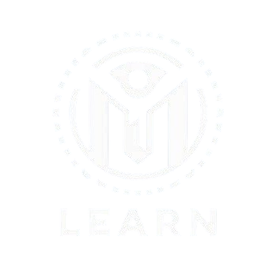
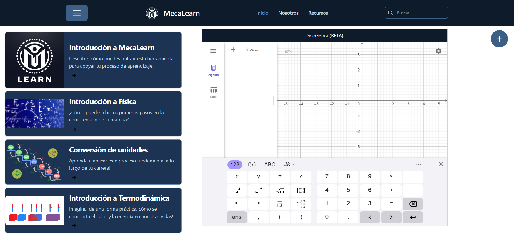
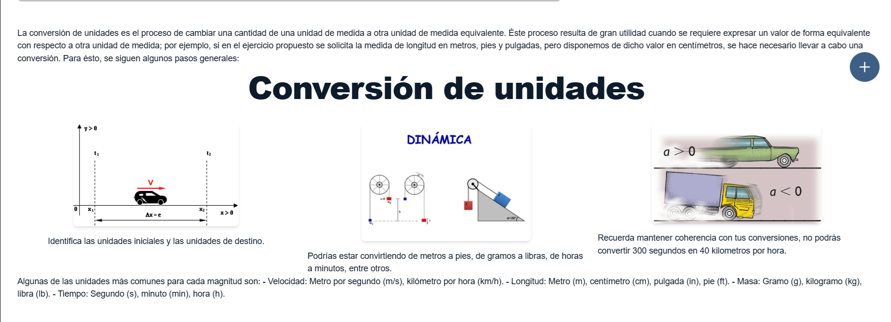

<h1 align="center">
  <br>
  <a href="https://github.com/soulsdevyer/soulsdevyer.github.io"></a>
  <br>
  MecaLearn
  <br>
</h1>

<h4 align="center">Una aplicación de código abierto para conectarse con el mundo de la ingeniería y la física de una forma innovadora por medio de  <a href="https://astro.build" target="_blank">Astro</a>.</h4>

<!-- Badges -->
<p align="center">
  
</p>

<p align="center">
  <a href="#key-features">Características</a> •
  <a href="#how-to-use">Cómo clonar</a> •
  <a href="#download">Acceso</a> •
  <a href="#credits">Créditos</a> •
  <a href="#related">Extras</a> •
  <a href="#license">Licencia</a>
</p>




## Características

- **Conexión directa con la ingeniería y la física para estudiantes**
  - MecaLearn es una plataforma diseñada para que los estudiantes se conecten con la ingeniería y la física a través de un aprendizaje dinámico y práctico.
- **Integración de herramientas avanzadas**
  - Incluye GeoGebra para visualizaciones interactivas y aplicaciones de IoT como el sensor DHT11 y el módulo HC-05 para experimentación real.
- **Interfaz E-Learning inspirada en Platzi y KhanAcademy**
  - El diseño de los temas se inspira en plataformas de aprendizaje digital populares, manteniendo el estilo único de MecaLearn.
- **Soporte para módulos personalizados**
  - Cada tema de aprendizaje, como "Introducción a la Termodinámica", sigue una estructura modular y reutilizable para componentes educativos como encabezados, párrafos y galerías de imágenes.
- **Desarrollado en Astro**
  - La aplicación se desarrolla completamente en Astro sin dependencias de frameworks como React, garantizando rendimiento optimizado y simplicidad.
- **Soporte de TypeScript**
  - Todo el código JavaScript está adaptado a TypeScript para mejorar la reutilización y escalabilidad de los scripts.
- **Gestión de notas**
  - La plataforma permite a los estudiantes tomar notas de manera integrada, usando componentes de notas personalizados.
- **Estilo amigable y misión educativa**
  - Cada tema se alinea con la misión de MecaLearn, diseñada para proporcionar contenido educativo detallado y accesible.
- **Personalización de colores y tipografías**
  - MecaLearn utiliza una paleta de colores definida en Tailwind y tipografías específicas (Inter para títulos y Poppins para el cuerpo) para una identidad visual consistente.

## Cómo clonar

Para ejecutar el proyecto frontend de MecaLearn, necesitarás [Git](https://git-scm.com) y [Node.js](https://nodejs.org/en/download/). Luego, desde la terminal o línea de comandos de tu preferencia, ejecuta las siguientes líneas:

```bash
# Para clonar el repositorio:
$ git clone https://github.com/soulsdevyer/soulsdevyer.github.io.git

# En caso de utilizar una clave SSH para clonar:
$ git clone git@github.com:[tu usuario de GitHub]/soulsdevyer.github.io.git

# Para navegar al repositorio:
$ cd MecaLearn

# Para instalar las dependencias:
$ npm -i

# Por último, para ejecutar la aplicación:
$ npm run dev
```

> **Nota:**
> Tal y como indica la terminal una vez se ejecuta la aplicación, el puerto por defecto en el que podrás acceder a esta es el **localhost:4321**. Puedes acceder a esta dirección **desde tu navegador o con Ctrl + Click en el link dentro de la línea de comandos**.

## Acceso

Puedes ingresar a MecaLearn en su versión desplegada para producción desde el siguiente [link](https://soulsdevyer.github.io).

<!-- ## Emailware

Markdownify is an [emailware](https://en.wiktionary.org/wiki/emailware). Meaning, if you liked using this app or it has helped you in any way, I'd like you send me an email at <bullredeyes@gmail.com> about anything you'd want to say about this software. I'd really appreciate it! -->

## Créditos

MecaLearn utiliza los siguientes paquetes y tecnologías para mantenerse y desarrollarse:

- [Electron](http://electron.atom.io/)
- [Node.js](https://nodejs.org/)

<!-- ## Extras -->

<!-- [Link](url)-->

## Contribución

<p> Próximamente encontrarás una guía detallada sobre cómo contribuir a este proyecto, incluyendo 
<strong> lineamientos y recursos, junto con las reglas de la comunidad.</strong></p>

<!-- <a href="https://buymeacoffee.com/amitmerchant" target="_blank"></a>

<a href="https://www.patreon.com/amitmerchant">
	
</a> -->

## Licencia: MIT

---

> [Ingreso a MecaLearn](soulsdevyer.github.io) &nbsp;&middot;&nbsp;
> GitHub Yermain Marcella: [@soulsdevyer](https://github.com/soulsdevyer) &nbsp;&middot;&nbsp;
> GitHub Fabián Cortéz: [@AgentX-5](https://github.com/AgentX-5) &nbsp;&middot;&nbsp;
